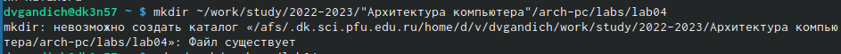
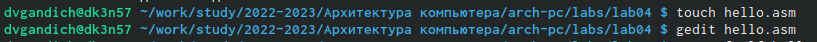
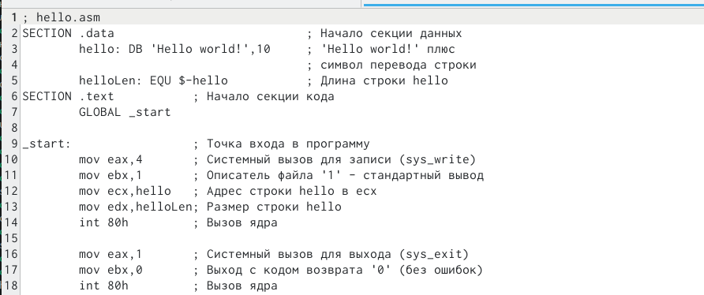
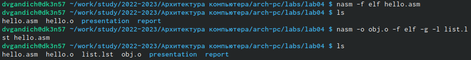
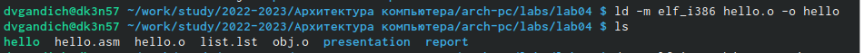
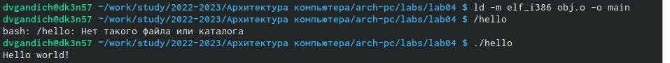
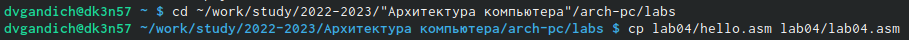
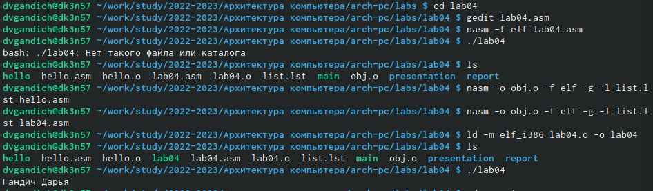

---
## Front matter
title: "Отчёт по лабораторной работе №4. Создание и процесс обработки программ на языке ассемблера NASM"
subtitle: "Арихитектура вычеслительных систем"
author: " Гандич Дарья Владимировна. НБИбд-02-22."

## Generic otions
lang: ru-RU
toc-title: "Содержание"

## Bibliography
bibliography: bib/cite.bib
csl: pandoc/csl/gost-r-7-0-5-2008-numeric.csl

## Pdf output format
toc: true # Table of contents
toc-depth: 2
lof: true # List of figures
lot: true # List of tables
fontsize: 12pt
linestretch: 1.5
papersize: a4
documentclass: scrreprt
## I18n polyglossia
polyglossia-lang:
 name: russian
 options:
 - spelling=modern
 - babelshorthands=true
polyglossia-otherlangs:
 name: english
## I18n babel
babel-lang: russian
babel-otherlangs: english
## Fonts
mainfont: PT Serif
romanfont: PT Serif
sansfont: PT Sans
monofont: PT Mono
mainfontoptions: Ligatures=TeX
romanfontoptions: Ligatures=TeX
sansfontoptions: Ligatures=TeX,Scale=MatchLowercase
monofontoptions: Scale=MatchLowercase,Scale=0.9
## Biblatex
biblatex: true
biblio-style: "gost-numeric"
biblatexoptions:
 - parentracker=true
 - backend=biber
 - hyperref=auto
 - language=auto
 - autolang=other*
 - citestyle=gost-numeric
## Pandoc-crossref LaTeX customization
figureTitle: "Рис."
tableTitle: "Таблица"
listingTitle: "Листинг"
lofTitle: "Список иллюстраций"
lotTitle: "Список таблиц"
lolTitle: "Листинги"
## Misc options
indent: true
header-includes:
 - \usepackage{indentfirst}
 - \usepackage{float} # keep figures where there are in the text
 - \floatplacement{figure}{H} # keep figures where there are in the text
---

# Цель работы

Освоение процедуры компиляции и сборки программ, написанных на ассем-
блере NASM.

# Задание

1. В каталоге ~/work/arch-pc/lab04 с помощью команды cp создайте копию
файла hello.asm с именем lab4.asm
2. С помощью любого текстового редактора внесите изменения в текст про-
граммы в файле lab4.asm так, чтобы вместо Hello world! на экран выво-
дилась строка с вашими фамилией и именем.
3. Оттранслируйте полученный текст программы lab4.asm в объектный
файл. Выполните компоновку объектного файла и запустите получивший-
ся исполняемый файл.
4. Скопируйте файлы hello.asm и lab4.asm в Ваш локальный репозиторий
в каталог ~/work/study/2022-2023/"Архитектура компьютера"/arch-
pc/labs/lab04/. Загрузите файлы на Github.

# Выполнение лабораторной работы

1. Создадим каталог для работы с программами на языке ассемблера NASM

{ #fig:001 width=90% }

2. В данном каталоге создаем файл с именем hello.asm и откроем этот файл с помощью текстового редактора gedit

{ #fig:002 width=90% }

3. Вводим текст из материалов по лабораторной работе №4

{ #fig:003 width=90% }

4. Вводим команду для компиляции текста, в итоге транслятор должен преобразовать текст
программы из файла hello.asm в объектный код, который запишется в файл hello.o. С помощью команды ls проверим, что объектный файл был создан. Скомпилируем исходный файл hello.asm в obj.o, снова с помощью команды ls проверим все ли файлы были созданы.

{ #fig:004 width=90% }

5. Передадим объектный файл на обработку компоновщику, чтобы получить исполняемую программу. Проверим, что файл hello был создан.

{ #fig:005 width=90% }

6. Зададим имя создаваемого исполняемого файла и запустим созданный файл на исполнение.

{ #fig:006 width=90% }

7. В каталоге данной лабораторной работы создаем копию файла hello.asm с именем lab4.asm. 

{ #fig:007 width=90% }

8. Проведем подобные действия, которые мы делали с файлом hello.asm, с файлом lab4.asm, чтобы вывести на экран имя и фамилию. Оттрансилурем данный файл в объектный и запустим.

{ #fig:008 width=90% }

9. Загрузим файлы в репозиторий

# Вывод

Мы освоили процедуры компиляции и сборки программ, написанных на ассемблере NASM.

::: {#refs}
:::
