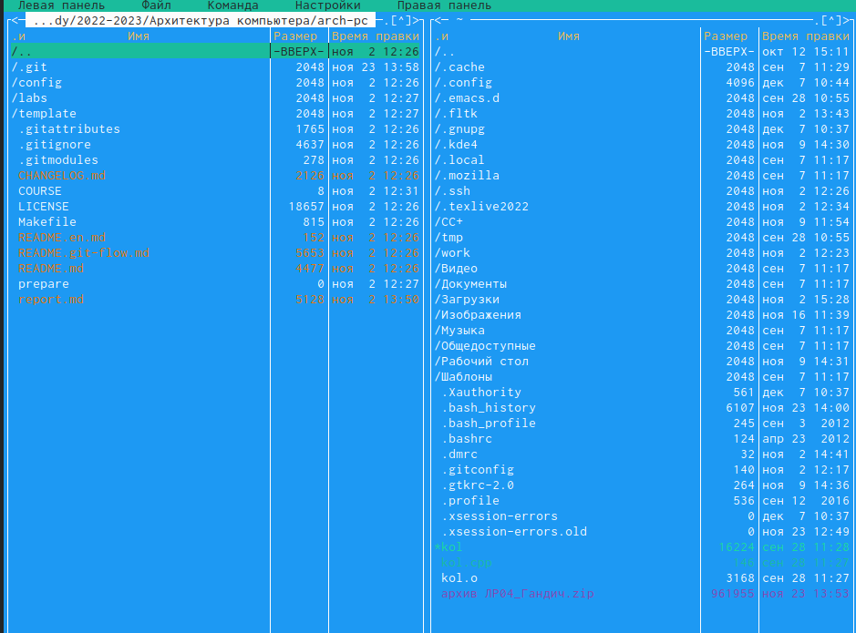
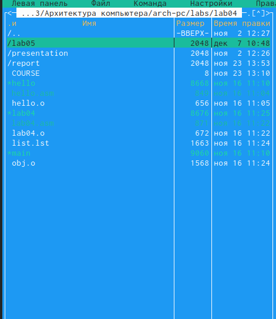
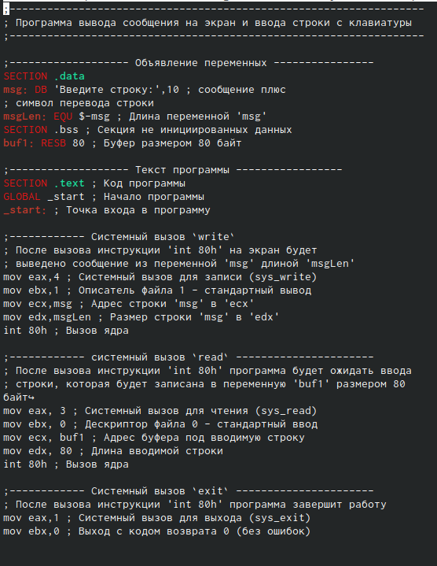
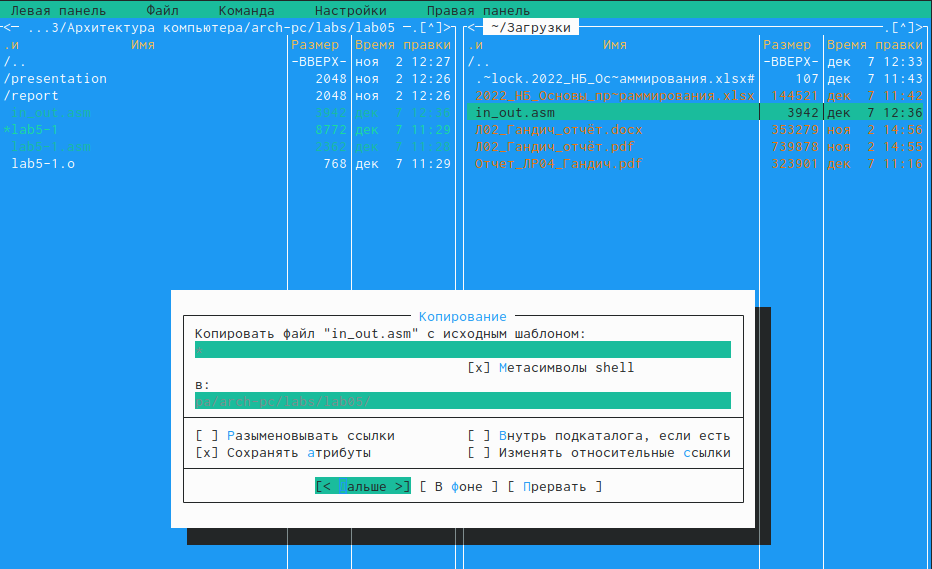
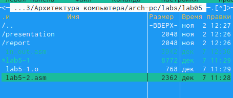
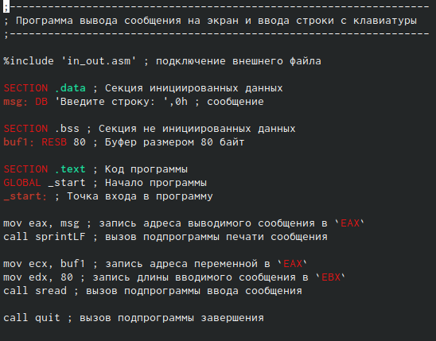
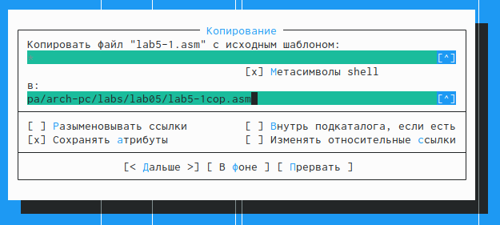
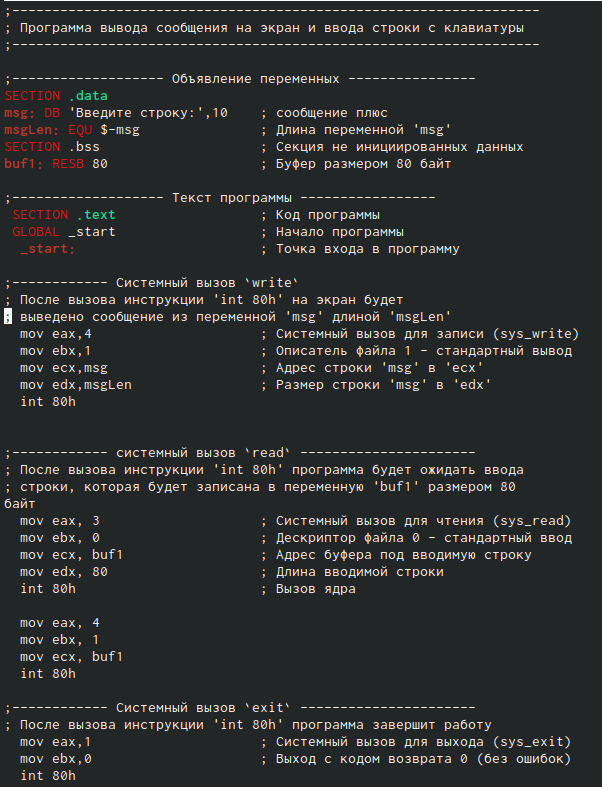
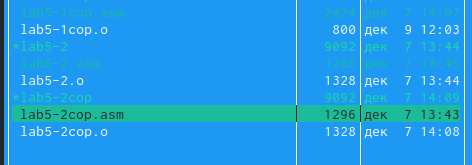
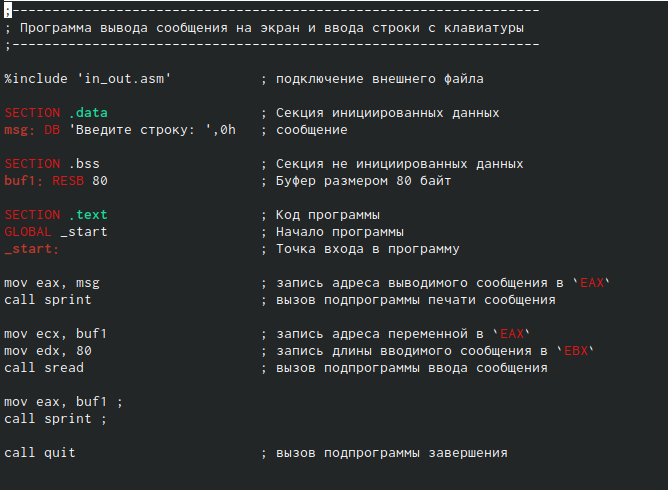

---
## Front matter
title: "Отчёт по лабораторной работе №5. Основы работы с Midnight Commander (mc). Структура программы на языке ассемблера NASM. Системные вызовы в ОС GNU Linux"
subtitle: "Арихитектура вычеслительных систем"
author: " Гандич Дарья Владимировна. НБИбд-02-22."

## Generic otions
lang: ru-RU
toc-title: "Содержание"

## Bibliography
bibliography: bib/cite.bib
csl: pandoc/csl/gost-r-7-0-5-2008-numeric.csl

## Pdf output format
toc: true # Table of contents
toc-depth: 2
lof: true # List of figures
lot: true # List of tables
fontsize: 12pt
linestretch: 1.5
papersize: a4
documentclass: scrreprt
## I18n polyglossia
polyglossia-lang:
 name: russian
 options:
 - spelling=modern
 - babelshorthands=true
polyglossia-otherlangs:
 name: english
## I18n babel
babel-lang: russian
babel-otherlangs: english
## Fonts
mainfont: PT Serif
romanfont: PT Serif
sansfont: PT Sans
monofont: PT Mono
mainfontoptions: Ligatures=TeX
romanfontoptions: Ligatures=TeX
sansfontoptions: Ligatures=TeX,Scale=MatchLowercase
monofontoptions: Scale=MatchLowercase,Scale=0.9
## Biblatex
biblatex: true
biblio-style: "gost-numeric"
biblatexoptions:
 - parentracker=true
 - backend=biber
 - hyperref=auto
 - language=auto
 - autolang=other*
 - citestyle=gost-numeric
## Pandoc-crossref LaTeX customization
figureTitle: "Рис."
tableTitle: "Таблица"
listingTitle: "Листинг"
lofTitle: "Список иллюстраций"
lotTitle: "Список таблиц"
lolTitle: "Листинги"
## Misc options
indent: true
header-includes:
 - \usepackage{indentfirst}
 - \usepackage{float} # keep figures where there are in the text
 - \floatplacement{figure}{H} # keep figures where there are in the text
---

# Цель работы

Приобретение практических навыков работы в Midnight Commander. Освоение инструкций языка ассемблера mov и int.

# Задание

1. Создайте копию файла lab6-1.asm. Внесите изменения в программу (без
использования внешнего файла in_out.asm), так чтобы она работала по
следующему алгоритму:
• вывести приглашение типа “Введите строку:”;
• ввести строку с клавиатуры;
• вывести введённую строку на экран.
2. Получите исполняемый файл и проверьте его работу. На приглашение
ввести строку введите свою фамилию
3. Создайте копию файла lab6-2.asm. Исправьте текст программы с исполь-
зование подпрограмм из внешнего файла in_out.asm, так чтобы она ра-
ботала по следующему алгоритму:
• вывести приглашение типа “Введите строку:”;
• ввести строку с клавиатуры;
• вывести введённую строку на экран.

# Выполнение лабораторной работы

1. Откроем Midnight Commander и создадим каталог lab05 (сначала создала каталог в lab04, так как пункты 2 и 3 были друг за другом. потрм перенесла).

{ #fig:001 width=90% }
{ #fig:002 width=90% }

2. Через командную строку создаем файл lab5-1.asm (с помощью команды touch).

{ #fig:003 width=90% }

3. Проверяем, что файл создан, переходим в него и вводим текст программы из листинга 6.1 из материалов.

{ #fig:004 width=90% }

4. Оттранслируем текст программы lab5-1.asm в объектный файл через строку ввода, программа должна вывести "Введите строку: ".

{ #fig:005 width=90% }

5. Скачиваем файл in_out.asm и копируем его в каталог с файлом lab5-1.asm

{ #fig:006 width=90% }

6. Создаем копию файла lab5-1.asm с именем lab5-2.asm и перепишем текст программы из листинга 6.2. 

{ #fig:007 width=90% }
{ #fig:008 width=90% }

7. Заменим в тексте подпрограмму sprintLF на sprint, создадим исполняемые файлы и заметим разницу: при подпрограмме springLF строка ввода сносится вниз, а при sprint остается на той же строке, где и находится условие

{ #fig:009 width=90% }
{ #fig:010 width=90% }
{ #fig:011 width=90% }

Задание для самостоятельной работы:

1. Создаем копию файла lab5-1.asm, вносим изменения в программу, так чтобы она работала по алгоритму из условия.

{ #fig:012 width=90% }
{ #fig:013 width=90% }
{ #fig:014 width=90% }

2. Теперь проделаем все то же самое с файлом lab5-2.asm

{ #fig:015 width=90% }
{ #fig:016 width=90% }
{ #fig:017 width=90% }

# Вывод

Мы научились работать в mc, приобрели практические навыки в нем, освоили инстукции языка ассемблера.

::: {#refs}
:::
