---
## Front matter
title: "Отчёт по лабораторной работе №6. Арифметические операции в NASM."
subtitle: "Арихитектура вычеслительных систем"
author: " Гандич Дарья Владимировна. НБИбд-02-22."

## Generic otions
lang: ru-RU
toc-title: "Содержание"

## Bibliography
bibliography: bib/cite.bib
csl: pandoc/csl/gost-r-7-0-5-2008-numeric.csl

## Pdf output format
toc: true # Table of contents
toc-depth: 2
lof: true # List of figures
lot: true # List of tables
fontsize: 12pt
linestretch: 1.5
papersize: a4
documentclass: scrreprt
## I18n polyglossia
polyglossia-lang:
 name: russian
 options:
 - spelling=modern
 - babelshorthands=true
polyglossia-otherlangs:
 name: english
## I18n babel
babel-lang: russian
babel-otherlangs: english
## Fonts
mainfont: PT Serif
romanfont: PT Serif
sansfont: PT Sans
monofont: PT Mono
mainfontoptions: Ligatures=TeX
romanfontoptions: Ligatures=TeX
sansfontoptions: Ligatures=TeX,Scale=MatchLowercase
monofontoptions: Scale=MatchLowercase,Scale=0.9
## Biblatex
biblatex: true
biblio-style: "gost-numeric"
biblatexoptions:
 - parentracker=true
 - backend=biber
 - hyperref=auto
 - language=auto
 - autolang=other*
 - citestyle=gost-numeric
## Pandoc-crossref LaTeX customization
figureTitle: "Рис."
tableTitle: "Таблица"
listingTitle: "Листинг"
lofTitle: "Список иллюстраций"
lotTitle: "Список таблиц"
lolTitle: "Листинги"
## Misc options
indent: true
header-includes:
 - \usepackage{indentfirst}
 - \usepackage{float} # keep figures where there are in the text
 - \floatplacement{figure}{H} # keep figures where there are in the text
---

# Цель работы

Освоение арифметических инструкций языка ассемблера NASM

# Задание

1. Написать программу вычисления выражения 𝑦 = 𝑓(𝑥). Программа должна
выводить выражение для вычисления, выводить запрос на ввод значения
𝑥, вычислять заданное выражение в зависимости от введенного 𝑥, выво-
дить результат вычислений. Вид функции 𝑓(𝑥) выбрать из таблицы 6.3
вариантов заданий в соответствии с номером полученным при выполне-
нии лабораторной работы. Создайте исполняемый файл и проверьте его
работу для значений 𝑥1 и 𝑥2 из 6.3.

# Выполнение лабораторной работы

1. Создаем файл lab6-1.asm в каталоге лаборотрной работы и переносим текст из листинга 7.1.

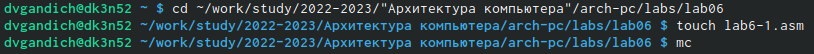{ #fig:001 width=90% }
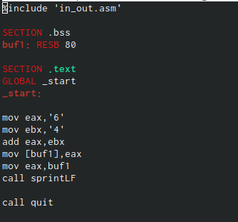{ #fig:002 width=90% }

2. Создаем исполняемый файл и запускам его, получаем символ j.

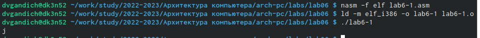{ #fig:003 width=90% }

3. Изменим текст листинга, убрав кавычки у цифр, снова запустим исполнемый файл, получим пустое поле.

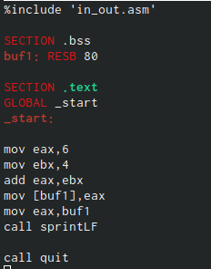{ #fig:004 width=90% }
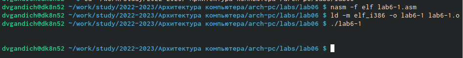{ #fig:005 width=90% }

4. Создаем файл lab6-2.asm, переписываем текст листинга 7.2, запускаем, далее меняем листинг,убрав кавычки. В первом случае строка выводит 106, во втором - 10.

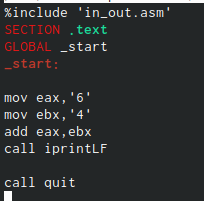{ #fig:006 width=90% }
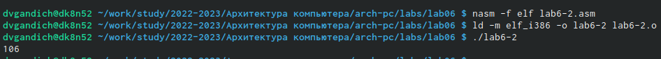{ #fig:007 width=90% }
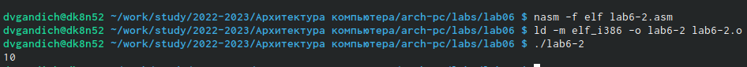{ #fig:008 width=90% }

5. Теперь заменим iprintLF на iprint в листинге и сделаем вывод, что LF отвечает за перенос строки.

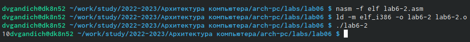{ #fig:009 width=90% }

6. Создаем файл lab6-3.asm, переписываем текст листинга 7.3., запускаем исполняемый файл. 

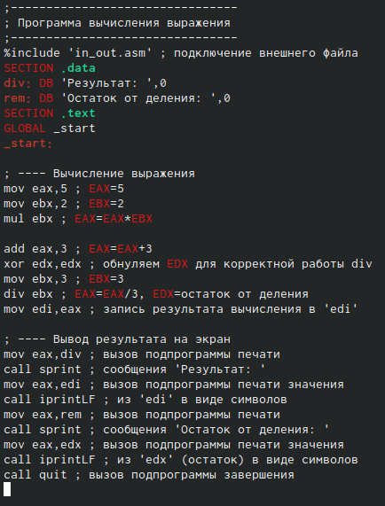{ #fig:010 width=90% }
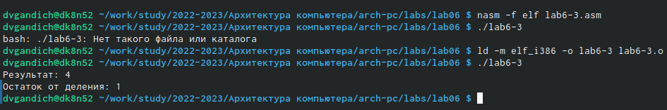{ #fig:011 width=90% }

7. Заменим в тексте листинга числа для вычисления выражения 𝑓(𝑥) = (4 ∗ 6 + 2)/5.

{ #fig:012 width=90% }
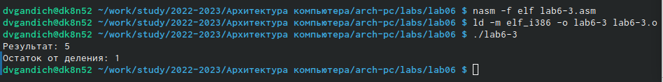{ #fig:013 width=90% }

8. Создаем файл variant.asm, переписываем текст листинга 7.4, запускаем исполняемый файл, узнаем свой вариант.

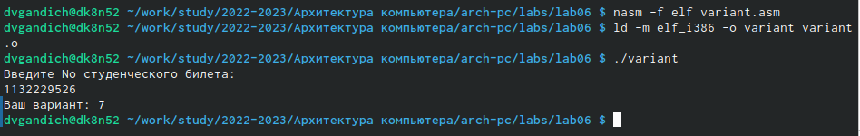{ #fig:014 width=90% }

Вопросы:
1. Какие строки листинга 7.4 отвечают за вывод на экран сообщения ‘Ваш вариант:’?

Ответ:
mov eax,rem
call sprint

2. Для чего используется следующие инструкции? nasm mov ecx, x mov edx, 80 call sread

Ответ:
mov ecx, x - присвоение значения x переменной есх
mov edx, 80 - присвоение значения 80 переменной edx 
nasm - переход к языку ассемблера
call sread - для считывания в переменную какого то числа

3. Для чего используется инструкция “call atoi”?

Ответ: конвертирует строку в величину типа int
 
4. Какие строки листинга 7.4 отвечают за вычисления варианта?

Ответ:
xor edx,edx
mov ebx,20
div ebx
inc edx

5. В какой регистр записывается остаток от деления при выполнении инструкции “div ebx”?

Ответ: в регистр dx

6. Для чего используется инструкция “inc edx”?

Ответ: это инкремент для прибавления единицы к переменной.

7. Какие строки листинга 7.4 отвечают за вывод на экран результата вычис-
лений?

Ответ:
mov eax,rem
call sprint
mov eax,edx
call iprintLF

Задание для самостоятельной работы:

1. Я попыталась составить программу для вычисления 5(𝑥 − 1)^2. Не знаю в чем проблема, но исходный файл не создается.
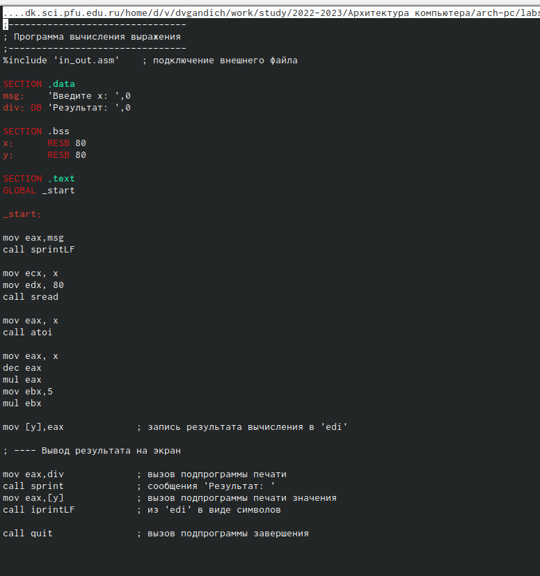{ #fig:015 width=90% }

# Вывод

Мы освоили арифметические функции языка ассемблера nasm.
.
::: {#refs}
:::
